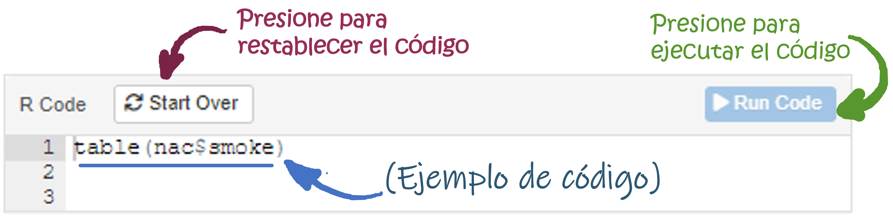

```{r setup, include=FALSE}
# Attach packages:

library(learnr)
library(fontawesome)
library(ggplot2)
library(tidyverse)
#gradethis::gradethis_setup()
#tutorial_options(exercise.timelimit = 60)

# Global code chunk settings:
knitr::opts_chunk$set(tutorial.exercise.setup = "global")

```


```{r banner, echo=FALSE, results='asis'}
htmltools::HTML("
  <div style='
    text-align: center;
    margin-bottom: 20px;
  '>
    
  </div>
")
```
  
```{r, echo=FALSE, results='asis'}
htmltools::tags$style(HTML("
  h1 {
    color: #1e90ff; /* Azul para títulos principales */
  }

  h2 {
    color: #007bff; /* Azul brillante para subtítulos */
  }

  h3 {
    color: #0056b3; /* Azul más oscuro para subtítulos más pequeños */
  }
"))
```


## Introducción


```{r, echo=FALSE, out.width="100%", fig.align = "center"}
  
```


<div class="alert alert-info" role="alert">
Este tutorial interactivo le permitirá aplicar los conceptos aprendidos sobre  <strong> estadística no paramétrica </strong> mediante la ejecución de código en `R`. A través de ejemplos guiados y ejercicios prácticos, usted desarrollará habilidades para implementar pruebas estadísticas no paramétricas, interpretar sus resultados y tomar decisiones informadas en contextos donde no se cumplen los supuestos de normalidad. 
</div>

### ¿Qué aprenderá en esta actividad?

Durante el tutorial, usted aplicará los siguientes conceptos:  

- Pruebas de Normalidad.
- Prueba chi-cuadrado. 
- Prueba del signo y prueba de sumas de rangos de wilcoxon. 
- Prueba U de Mann Whitney. 
- Prueba de McNemar. 


<h3>Créditos</h3>

<p><strong>Autor:</strong> Erika J. Cantor</p>
<p><strong>Afiliación:</strong> Departamento de Epidemiología Clínica y Bioestadística, Facultad de Medicina. Pontificia Universidad Javeriana</p>
<p><strong>Contacto:</strong> <a href="mailto:erika.cantor@javeriana.edu.co">erika.cantor@javeriana.edu.co</a></p>

<p>Este tutorial ha sido desarrollado como parte del curso de <em>Introducción a la Bioestadística en la Maestría en Epidemiología Clínica</em>.</p>


<a rel="license" href="http://creativecommons.org/licenses/by-nc-sa/4.0/"></a><br />Esta obra está licenciada bajo
<a rel="license" href="http://creativecommons.org/licenses/by-nc-sa/4.0/">licencia
de Creative Commons Reconocimiento-NoComercial-CompartirIgual 4.0
Internacional</a>.

##  ¿Cómo desarrollar este tutorial?

A lo largo del tutorial, encontrará ejemplos de código, ejercicios de programación y preguntas de análisis. Los ejemplos de código y los ejercicios pretenden introducir habilidades básicas de `R`. No es
necesario tener conocimientos previos sobre R para el desarrollo de este tutorial.

#### `r fa("lightbulb", fill = "orange",  height="2em", width="2em")` = Ejemplo de código

Este icono identifica ejemplos de código listos para usar. Es posible explorar, ejecutar y modificar este código para comprender el funcionamiento de cada función o comando. Para ejecutar el código, solo es necesario presionar el botón **Run code** en la esquina superior derecha.


```{r, echo=FALSE, out.width="100%", fig.align = "center"}
  
```

> **No es necesario preocuparse por “dañar” el código:** si se realizan modificaciones que generan errores, el ejemplo original puede restaurarse en cualquier momento mediante el botón **Start Over** en la esquina superior izquierda.


#### `r fa("pencil-alt", fill = "green", height="2em", width="2em")` = Ejercicio de código

Los ejercicios están diseñados para aplicar lo aprendido, escribiendo el código necesario para resolver las preguntas o problemas planteados.

> **Si siente que se ha quedado sin ideas o no sabe cómo continuar con el ejercicio:** puede consultar el botón **Solution** (solución) o **Hint** (pista) para recibir orientación sin perder la oportunidad de aprender activamente.

```{r, echo=FALSE, out.width="100%", fig.align = "center"}
knitr::include_graphics("images/ejercicio.png")  
```

#### `r fa("comments", fill = "#2c5697", height="2em", width="2em")` = Preguntas de análisis

Estas preguntas invitan a reflexionar sobre los resultados y conceptos. Algunas no poseen una única respuesta correcta, sino que buscan fomentar el pensamiento crítico. Con frecuencia, estas preguntas están vinculadas con un ejemplo o ejercicio de código, y pueden requerir la ejecución de dicho código para obtener la información necesaria para responderlas.

## Explorando el Nacimiento con Datos


<div style="background-color: #f8f9fa; color: #212529; border: 1px solid #ddd; padding: 15px; border-radius: 5px;">
En este taller, usted trabajará con la base de datos `birthwt`, que contiene información sobre el peso al nacer de  189 nacidos vivos en 1986 en el Bay State Medical Center, Springfield. Las variables recolectadas fueron: 
</div>
  
- Bajo Peso (`low`): 0: Peso Normal (>2.5Kg) 1: Bajo peso (<2.5 Kg)

- Edad de la madre en años (`age`).

- Peso de la madre en libras (`lwt`)

- Raza de la madre (`race`): 1: Blanco, 2: Negro, 3: Otra.

- Fumar (`smoke`): 1: Si, 0: No.

- Antecedente de hipertensión (`ht`):  1: Si, 0: No.

- Número  de partos prematuros previos (`ptl`).

- Irritación uterina (`ui`): 1: Si, 0: No

- Número de visitas en el primer trimestre (`ftv`).


La base de datos puede ser cargada por medio del siguiente código en `R`. Antes de iniciar con el análisis, primero vamos a etiquetar algunas variables categóricas del conjunto de datos `datos`. En particular, transformaremos las variables `low`, `race`, `smoke`, `ht`y `ui`  en cualitativas con etiquetas más descriptivas que faciliten la interpretación.

```{r global, exercise=FALSE}
# Datos
datos <- MASS::birthwt

# Etiquetas
datos$low <- factor(datos$low, labels = c("Normal", "Bajo Peso"))
datos$race <- factor(datos$race, labels = c("Blanco", "Negro", "Otro"))
datos$smoke <- factor(datos$smoke, labels = c("No fuma", "Fuma"))
datos$ht    <- factor(datos$ht, labels = c("No", "Sí"))
datos$ui    <- factor(datos$ui, labels = c("No", "Sí"))

head(datos)
```


```{r ver-global, exercise=TRUE, exercise.setup="global", exercise.eval=FALSE}

#Librerias
library(ggplot2)
library(tidyverse)

# Datos
datos <- MASS::birthwt

# Etiquetas
datos$low <- factor(datos$low, labels = c("Normal", "Bajo Peso"))
datos$race <- factor(datos$race, labels = c("Blanco", "Negro", "Otro"))
datos$smoke <- factor(datos$smoke, labels = c("No fuma", "Fuma"))
datos$ht    <- factor(datos$ht, labels = c("No", "Sí"))
datos$ui    <- factor(datos$ui, labels = c("No", "Sí"))

head(datos)

```

Ahora que hemos etiquetado las variables, podemos explorar el conjunto de datos para verificar que las etiquetas se hayan aplicado correctamente.


## Pruebas de Normalidad

Evaluar el ajuste a la normalidad es un paso crucial antes de aplicar pruebas estadísticas. En este caso, utilizaremos la prueba de Shapiro-Wilk para evaluar si las variables `age`, `lwt` y `bwt` siguen una distribución normal.


En `R`, la función `shapiro.test()` permite aplicar la prueba de Shapiro-Wilk para evaluar si una variable sigue una distribución normal. De manera complementaria, esta evaluación también puede realizarse visualmente mediante un gráfico Q-Q, utilizando la función `qqPlot()`.

Supongamos que nos interesa conocer si la variable `bwt` (peso al nacer) sigue una distribución normal, en `R` podemos realizar la prueba de normalidad de la siguiente manera:

```{r norm1, exercise=TRUE,  exercise.setup="global"}
# Prueba de normalidad para la variable 'bwt'
shapiro.test(datos$bwt)

# Gráfico Q-Q para la variable 'bwt'
car::qqPlot(datos$bwt, main = "Q-Q Plot de bwt")
```

Con base en los resultados de la prueba de normalidad, podemos concluir  que la variable `bwt` sigue una distribución normal, dado que el p valor de 0.435 es mayor al nivel de significancia $\alpha=0.05$ y por lo tanto, no existe suficiente evidencia para rechazar la hipótesis de normalidad. Además, el gráfico Q-Q muestra que los puntos se alinean aproximadamente a lo largo de la línea diagonal, lo que respalda la conclusión de normalidad. Ahora, vamos a aplicar la prueba de normalidad a las variables `age` y `lwt` para verificar si también siguen una distribución normal. 

### 🧠 Desafío 1

✍️ Es su turno! Emplee los siguientes chunk (bloque) para escribir el código de `R` para las dos variables. Tenga presente que tiene la opción de ver la solución (¡pero asegúrese de intentar resolverla manualmente primero!). Vamos a iniciar con la variable `age` (edad de la madre).

```{r norm2_ejerc1, exercise=TRUE, exercise.setup="global"}
# Prueba de normalidad para la variable 'age'


# Gráfico Q-Q para la variable 'age'

```


```{r norm2_ejerc1-solution}
# Prueba de normalidad para la variable 'age'
shapiro.test(datos$age)

# Gráfico Q-Q para la variable 'age'
car::qqPlot(datos$age)
```

Con estos resultados usted puede concluir que (Selecciona la respuesta correcta):

🎯 **Pruebe su conocimiento**

```{r logicals, echo = FALSE}
question(" ¿Qué podemos decir sobre la distribución de la variable `age`?",
         answer("La variable `age` no sigue una distribución normal, existe suficiente evidencia para rechazar  la hipótesis nula de normalidad con la prueba de Shapiro Wilk (p valor<0.05)", correct = TRUE),
         answer("La variable `age`  sigue una distribución normal, no existe suficiente evidencia para rechazar  la hipótesis nula de normalidad con la prueba de Shapiro Wilk (p valor<0.05)", message = "Incorrecto, si el p valor es menor al nivel de significancia se rechaza la hipótesis nula de normalidad"),
         allow_retry = TRUE
)
```

### 🧠 Desafío 2

✍️ Ahora, vamos a aplicar la prueba de normalidad a la variable `lwt` (peso de la madre) para verificar si también sigue una distribución normal. **¿Es normal la variable `lwt` (peso de la madre)?**

```{r norm2_ejerc2, exercise=TRUE, exercise.setup="global"}
# Prueba de normalidad para la variable 'lwt'


# Gráfico Q-Q para la variable 'lwt'

```


```{r norm2_ejerc2-solution}
# Prueba de normalidad para la variable 'lwt'
shapiro.test(datos$lwt)

# Gráfico Q-Q para la variable 'lwt'
car::qqPlot(datos$lwt)
```

## Pruebas no paramétricas: Una sola población

Supongamos que un investigador desea evaluar si la edad promedio de las madres es mayor a 18 años, considerando el contexto del embarazo en adolescentes. Para ello, se plantea como hipótesis nula que la edad promedio es igual a 18 años, y como hipótesis alternativa que es mayor a 18 años. Sin embargo, dado que la variable `age` (edad de la madre) no presenta una distribución normal, no es apropiado aplicar la prueba t de Student mediante la función `t.test()`. En su lugar, se empleará la prueba no paramétrica del signo de Wilcoxon para una muestra, la cual se basa en las medianas, con el fin de contrastar esta hipótesis.

$$H_0: Mediana_{age}=18 \;vs. \; Mediana_{age}<18 $$
En `R`, la función `SIGN.test()` del paquete `BSDA` permite realizar la prueba del signo de Wilcoxon. Esta función requiere especificar el vector de datos (`datos$age`), la mediana hipotética (`md=18`), el tipo de alternativa (`alternative=greater`) y el nivel de confianza asociado al nivel de significancia ((`conf.level=0.95`).
 

```{r wilcoxon1, exercise=TRUE, exercise.setup="global"}
# Prueba de Wilcoxon para la variable 'age'
BSDA::SIGN.test(datos$age, 
                md = 18, 
                alternative = "greater", 
                conf.level = 0.95)
```

<div style="background-color: #f8f9fa; color: #212529; border: 1px solid #ddd; padding: 15px; border-radius: 5px;">
Dado que el p-valor de la prueba es menor a 2.2e-16 y se utiliza un nivel de significancia de 0.05, existe suficiente evidencia para rechazar la hipótesis nula. Por lo tanto, se concluye que la mediana de la edad de las madres es significativamente mayor a 18 años. Esto sugiere que, la mayoría de las madres tienen más de 18 años.
</div>

### 🧠 Desafío 1

Ahora, el investigador desea evaluar si el peso al nacer promedio es mayor a 2500 gramos. Para ello, se plantea como hipótesis nula que el peso al nacer promedio es igual a 2500 gramos, y como hipótesis alternativa que es mayor a 2500 gramos. Con esta información responda la siguiente pregunta:

🎯 **Pruebe su conocimiento**

```{r logicals2, echo = FALSE}
question("¿Cuál es la prueba estadística más adecuada para probar la hipotesis del investigador sobre el peso al nacer `bwt`?",
         answer("Se debe usar la prueba t de Student", correct = TRUE, message = "Correcto, la variable `bwt` sigue una distribución normal, por lo tanto se debe usar la prueba t de Student"),
         answer("Se debe usar  la prueba no paramétrica del signo de Wilcoxon" , message = "Incorrecto, lla variable `bwt` sigue una distribución normal, por lo tanto se debe usar la prueba t de Student. La prueba del signo solo aplicaría si la variable NO tiene un comportamiento normal"),
         allow_retry = FALSE
)
```


✍️ Es su turno! Emplee el siguiente chunk (bloque) para escribir el código de `R` y continuar ayudando al investigador. ¿Existe evidencia para pensar que el peso promedio al nacer es mayor a 2500 gramos? 

```{r wilcoxon1_ejerc1, exercise=TRUE, exercise.setup="global"}

# Prueba para la variable 'bwt'


```


```{r wilcoxon1_ejerc1-solution}

# Prueba para la variable 'bwt'
t.test(datos$bwt, 
      mu = 2500, 
      alternative = "greater", 
      conf.level = 0.95)
```

<div class="alert alert-info" role="alert">
🗣️ **Nota**: Lo invitamos a socializar sus hallazgos en el foro de la semana.
</div>

## Pruebas no paramétricas: Dos poblaciones

Supongamos que un investigador desea evaluar si la edad promedio de las madres difiere de acuerdo al hábito de fumar. Para ello se plantea la hipótesis nula que la edad promedio de las madres que fuman es igual a la de las que no fuman, y como hipótesis alternativa que la edad promedio de las madres que fuman es diferente a la de las que no fuman.

Para decidir qué tipo de prueba estadística utilizar, primero evaluaremos la distribución de la variable `age` de acuerdo al hábito de fumar `smoke`. Para ello, emplearemos la prueba de normalidad de Shapiro-Wilk.

```{r normality2, exercise=TRUE, exercise.setup="global"}

# Prueba de normalidad para la variable 'age' por grupo de fumar
datos%>% 
  group_by(smoke) %>% 
  summarise(shapiro_p_value = shapiro.test(age)$p.value)
```


Dado que la variable `age` (edad de la madre) no presenta una distribución normal (p valor<0.05), no es apropiado aplicar la prueba t de Student mediante la función `t.test()`. En su lugar, se empleará la prueba U de Mann-Whitney para dos muestras independientes, que se basa en las medianas, con el fin de contrastar esta hipótesis. En este caso, entonces las hipótesis a evaluar son:

$$H_0: Mediana_{age/Fumar}=Mediana_{age/NoFumar} \;vs. \; Mediana_{age/Fumar} \neq Mediana_{age/NoFumar} $$

Antes de realizar la prueba de Mann-Whitney, se podrían calcular las medianas en cada grupo para tener una idea de las diferencias entre los grupos. Esto se puede hacer utilizando la función `dplyr::summarise()`.

```{r medianas, exercise=TRUE, exercise.setup="global"}

# Calcular medianas de la variable 'age' por grupo de fumar
datos %>% 
  group_by(smoke) %>% 
  summarise(median_age = median(age, na.rm = TRUE),
            P25=quantile(age, 0.25, na.rm = TRUE),
            P75=quantile(age, 0.75, na.rm = TRUE))

```

En este paso, se observa que la mediana de la edad de las madres es muy similar entre aquellas que no fuman (23 años) y aquellas que fuman (22 años). Sin embargo, para determinar si esta diferencia es estadísticamente significativa, se debe realizar la prueba U de Mann-Whitney.

En `R`, la función `wilcox.test()` permite realizar la prueba U de Mann-Whitney. Esta función requiere especificar el vector de datos (`age`), el grupo de comparación (`smoke`), el tipo de hipótesis alternativa (`alternative="two.sided"`), y el nivel de confianza asociado al nivel de significancia (`conf.level=0.95`).

```{r mannwhitney1, exercise=TRUE, exercise.setup="global"}

# Prueba para comparar medianas en dos poblaciones
wilcox.test(age ~ smoke, 
            data = datos, 
            alternative = "two.sided", 
            conf.level = 0.95)

```


Con la salida anterior, entonces es posible concluir que no existe suficiente evidencia para rechazar la hipótesis nula de que las medianas de la edad de las madres que fuman y las que no fuman son iguales, dado que el p-valor es mayor a 0.05. Por lo tanto, se concluye que no hay una diferencia estadísticamente significativa en la edad promedio de las madres según su hábito de fumar.

### 🧠 Desafío 1

Ahora, el investigador desea evaluar si el peso al nacer promedio difiere de acuerdo al hábito de fumar. Para ello, se plantea la hipótesis nula que el peso al nacer promedio de los bebés de madres que fuman es igual al de los bebés de madres que no fuman, y como hipótesis alternativa que el peso al nacer promedio de los bebés de madres que fuman es diferente al de los bebés de madres que no fuman. 

Para evaluar esta hipótesis, primero se debe evaluar la distribución de la variable `bwt` (peso al nacer) de acuerdo al hábito de fumar `smoke`. Para ello, utilice el siguiente chunk (bloque) para escribir el código de `R` y continuar ayudando al investigador.

```{r normality2_ejerc1, exercise=TRUE, exercise.setup="global"}
# Prueba de normalidad para la variable 'bwt' por grupo de fumar


```

```{r normality2_ejerc1-solution}
# Prueba de normalidad para la variable 'bwt' por grupo de fumar
datos%>% 
  group_by(smoke) %>% 
  summarise(shapiro_p_value = shapiro.test(bwt)$p.value)
```

🎯 **Pruebe su conocimiento**


```{r logicals3, echo = FALSE}
question("Según el resultado de la prueba de Shapiro-Wilk, ¿la variable peso al nacer `bwt` sigue una distribución normal en ambos grupos de madres (fumadoras y no fumadoras)?",
         answer("Si, la distribución es normal en ambos grupos", correct = TRUE, message = "Correcto, la variable `bwt` sigue una distribución normal, dado que no se rechaza la hipótesis nula de normalidad en ambos grupos (p valor>0.05)"),
         answer("No, el peso al nacer sigue otra distribución de probabilidad" , message = "Incorrecto, el p valor de la prueba de Shapiro Wilk es mayor al nivel de significancia y por lo tanto, no se rechaza la hipótesis nula de normalidad en ambos grupos"),
         allow_retry = FALSE
)
```

Ahora que conocemos, la distribución de los datos, utilice el siguiente chunk (bloque) para escribir el código de `R` y continuar ayudando al investigador para responder la pregunta: ¿difiere el peso al nacer de los bebés de madres que fuman del de los bebés de madres que no fuman?


```{r mannwhitney2_ejerc1, exercise=TRUE, exercise.setup="global"}

# Estadísticas descriptivas del peso al nacer de acuerdo al hábito de fumar


# Prueba para comparar el peso al nacer de acuerdo al hábito de fumar

```

```{r mannwhitney2_ejerc1-solution}

# Estadísticas descriptivas del peso al nacer de acuerdo al hábito de fumar
datos%>% 
  group_by(smoke) %>% 
  summarise(media = mean(bwt, na.rm = TRUE),
            ds = sd(bwt, na.rm = TRUE))

# Prueba para comparar el peso al nacer de acuerdo al hábito de fumar

t.test(bwt ~ smoke, 
            data = datos, 
            alternative = "two.sided", 
            conf.level = 0.95)

```


🎯 **Pruebe su conocimiento**

```{r logicals4, echo = FALSE}
question("Según sus resultados, ¿difiere el peso al nacer  de los bebés de madres que fuman del de los bebés de madres que no fuman?",
         answer("Si, existe suficiente evidencia para rechazar la hipótesis nula con la prueba t Student", correct = TRUE),
         answer("Si, existe suficiente evidencia para rechazar la hipótesis nula con la prueba U de Mann Whitney" , message = "Incorrecto, la prueba U de Mann Whitney no es la adecuada, se debe usar la prueba t Student dado que la variable `bwt` sigue una distribución normal"),
            answer("No, no existe suficiente evidencia para rechazar la hipótesis nula con la prueba t Student", message= "La prueba es correcta, pero el p valor es menor a 0.05, por lo tanto se rechaza la hipótesis nula de igualdad de las medias"),
         answer("No, no existe suficiente evidencia para rechazar la hipótesis nula con la U de Mann Whitney" , message = "Incorrecto, la prueba U de Mann Whitney no es la adecuada"),   
         allow_retry = FALSE
)
```

<div class="alert alert-info" role="alert">
🗣️ **Nota**:Lo invitamos a socializar sus hallazgos en el foro de la semana respondiendo la siguiente pregunta: ¿El peso al nacer de los bebés de madres fumadoras es mayor o menor en comparación con los de madres no fumadoras?
</div>

## Prueba Chi-Cuadrado

Supongamos que un investigador desea evaluar si existe una asociación entre el hábito de fumar y el bajo peso al nacer de los bebés. Para ello, se plantea la hipótesis nula que no hay asociación entre las dos variables, y como hipótesis alternativa que sí hay asociación.

Para evaluar esta hipótesis, se puede utilizar la prueba de chi-cuadrado de Pearson, que es adecuada para analizar la relación entre dos variables cualitativas. En `R`, la función `chisq.test()` permite realizar esta prueba. Esta función requiere especificar una tabla de contingencia que muestre la frecuencia de cada combinación de categorías de las dos variables. 

```{r chi1, exercise=TRUE, exercise.setup="global"}

# Tabla de contingencia para las variables 'smoke' y 'low'

tabla_contingencia <- table(datos$smoke, datos$low)

# Prueba de chi-cuadrado de Pearson

# Test de Chi-cuadrado
result_chisq<-chisq.test(tabla_contingencia)

# Resultado del test
result_chisq

# Frecuencias esperadas

result_chisq$expected

```

Con base en estos resultados, podemos concluir que  sí existe suficiente evidencia para rechazar la hipótesis nula de que no hay asociación entre el hábito de fumar y el bajo peso al nacer, dado que el p-valor es menor a 0.05. Adicionalmente, dado que las frecuencias esperadas son mayores a 5, se cumplen los supuestos de la prueba de chi-cuadrado. 

```{r chi2, exercise=TRUE, exercise.setup="global"}
datos %>%
  group_by(smoke) %>%
  summarise(
    total = n(),
    bajo_peso = sum(low == "Bajo Peso"),
    porcentaje_bajo_peso = round(100 * bajo_peso / total, 1)
  )
```


Profundizando en los datos, observamos que el 40.5% de los bebés de madres fumadoras tienen bajo peso al nacer, mientras que  el 25.2% de los bebés de madres no fumadoras presentan esta condición, siendo esta diferencia estadísticamente significativa de acuerdo a los resultados de la prueba Chi-cuadrado. Esto sugiere que el hábito de fumar podría estar asociado con un mayor riesgo de bajo peso al nacer.

### 🧠 Desafío 1

Ahora, el investigador desea evaluar si existe una asociación entre la raza de la madre y el bajo peso al nacer. Para ello, se plantea la hipótesis nula que no hay asociación entre las dos variables, y como hipótesis alternativa que sí hay asociación.

Para evaluar esta hipótesis, utilice el siguiente chunk (bloque) para escribir el código de `R` y continuar ayudando al investigador.

```{r chi1_ejerc1, exercise=TRUE, exercise.setup="global"}
# Tabla de contingencia para las variables 'smoke' y 'low'


# Prueba de chi-cuadrado de Pearson

# Test de Chi-cuadrado

# Resultado del test

# Frecuencias esperadas


```


```{r chi1_ejerc1-solution}

# Tabla de contingencia para las variables 'smoke' y 'low'

tabla_contingencia <- table(datos$race, datos$low)

# Prueba de chi-cuadrado de Pearson

# Test de Chi-cuadrado
result_chisq<-chisq.test(tabla_contingencia)

# Resultado del test
result_chisq

# Frecuencias esperadas

result_chisq$expected

```

🎯 **Pruebe su conocimiento**

```{r logicals5, echo = FALSE}
question("Con base en los resultados anteriores, ¿Existe relación entre el bajo peso al nacer y la raza de la madre?",
         answer("No,  existe suficiente evidencia para no rechazar la hipótesis nula a un nivel de significancia de 0.05 y por lo tanto, el % de bajo peso al nacer no cambia significativamente de acuerdo a la raza de la madre", correct = TRUE),
         answer("Si,  existe suficiente evidencia para  rechazar la hipótesis nula a un nivel de significancia de 0.05 y por lo tanto, el % de bajo peso al nacer  cambia significativamente de acuerdo a la raza de la madre"),
         allow_retry = FALSE
)
```

<div class="alert alert-info" role="alert">
🗣️ **Nota**:Lo invitamos a socializar sus hallazgos en el foro de la semana respondiendo la siguiente pregunta: ¿El porcentaje de bajo peso al nacer de los bebés cambia de acuerdo a la raza de la madre?
</div>

## Prueba de McNemar

Un grupo de 100 pacientes hipertensos fue evaluado antes y después de una intervención educativa sobre hábitos saludables y la importancia de ser adherente al tratamiento. Se quiere saber si la proporción de pacientes que toman su medicación regularmente cambió antes y después de la intervención. 

Para ello, se plantea la hipótesis nula que no hay cambio en la proporción de pacientes que toman su medicación regularmente antes y después de la intervención y, como hipótesis alternativa que sí hay un cambio. En este caso, dado que se trata de una muestra pareada, se utilizará la prueba de McNemar, que es adecuada para comparar proporciones en muestras relacionadas.

En `R` esto es posible realizarlo con la función `mcnemar.test()`, que requiere una tabla de contingencia que muestre las frecuencias de cada combinación de categorías de las dos variables. 

```{r mcnemar1, exercise=TRUE, exercise.setup="global"}

# Tabla de contigencia

tabla <- matrix(c(40, 30, 10, 20), nrow = 2,
                dimnames = list(
                  "Antes" = c("Sí", "No"),
                  "Después" = c("Sí", "No"))
)

# Ver tabla
print(tabla)

# Prueba de McNemar
mcnemar.test(tabla)

```

Con base en estos resultados, es posible concluir que la intervención educativa tuvo un efecto significativo en la proporción de pacientes que toman su medicación regularmente, dado que el p-valor es menor a 0.05 ($p-value=0.0027$). Esto sugiere que la intervención logró aumentar la adherencia a la medicación entre los pacientes hipertensos pasando de 50% al 70%.


### 🧠 Desafío 1

Un investigador desea evaluar la efectividad de un nuevo tratamiento para el insomnio. A 80 pacientes se les aplicó un tratamiento durante 4 semanas. Se registró si presentaban insomnio antes y después del tratamiento. Los datos se presentan en el siguiente chunk (bloque) en el objeto `tabla2`.

Utilice el siguiente chunk (bloque) para escribir el código de `R` y continuar ayudando al investigador. ¿Existe evidencia para pensar que el tratamiento es efectivo?


```{r mcnemar1_ejerc1, exercise=TRUE, exercise.setup="global"}

# Tabla de contigencia

tabla2 <- matrix(c(30, 20, 5, 25), nrow = 2,
                dimnames = list(
                  "Antes" = c("Sí", "No"),
                  "Después" = c("Sí", "No"))
)

# Ver tabla


# Prueba de McNemar


```


```{r mcnemar1_ejerc1-solution}

# Tabla de contigencia

tabla2 <- matrix(c(30, 20, 5, 25), nrow = 2,
                dimnames = list(
                  "Antes" = c("Sí", "No"),
                  "Después" = c("Sí", "No"))
)

# Ver tabla
print(tabla2)

# Prueba de McNemar
mcnemar.test(tabla2)

```

<div class="alert alert-info" role="alert">
🗣️ **Nota**:Lo invitamos a socializar sus hallazgos en el foro de la semana respondiendo la siguiente pregunta: ¿Existe evidencia para pensar que el tratamiento en contra del insomnio es efectivo?
</div>